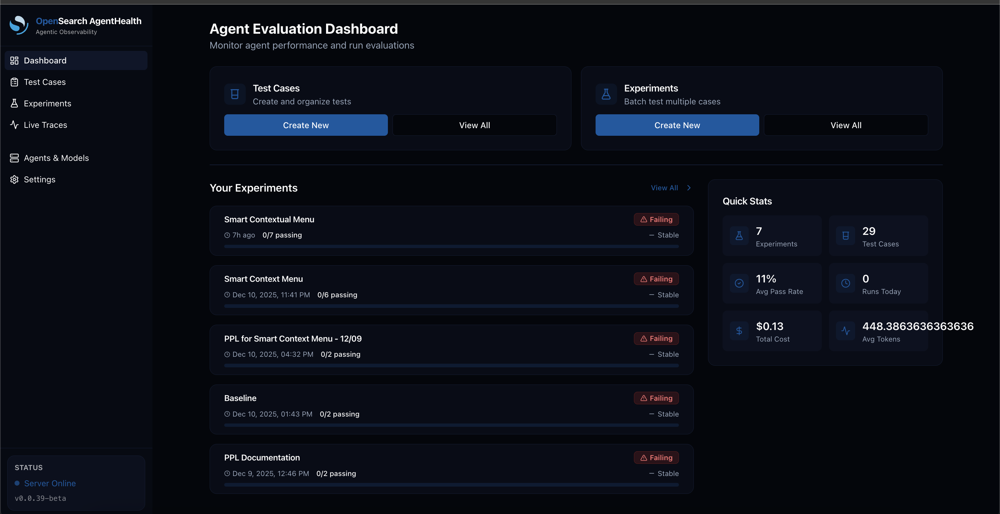
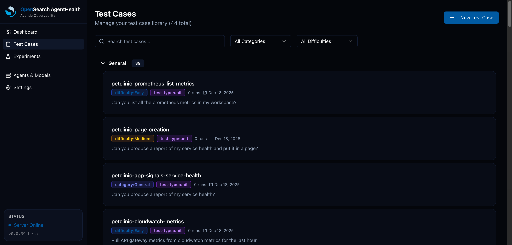
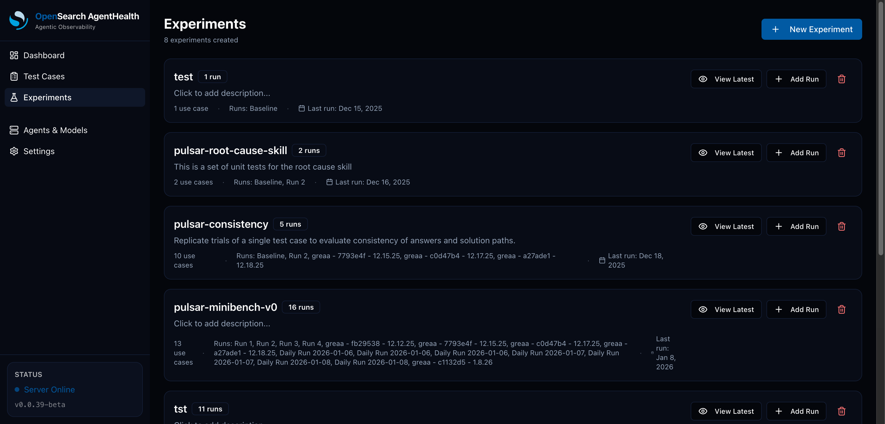
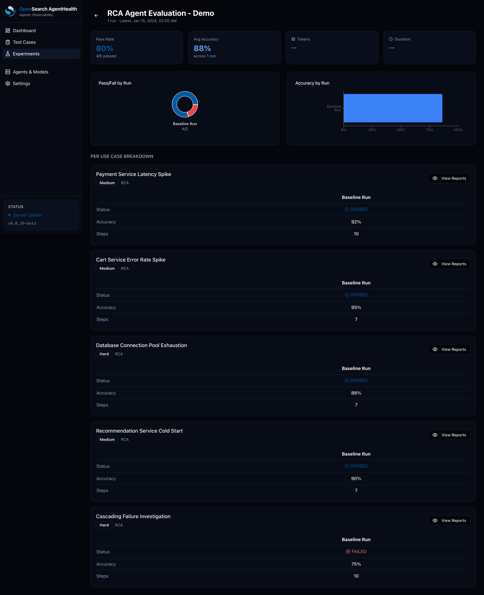
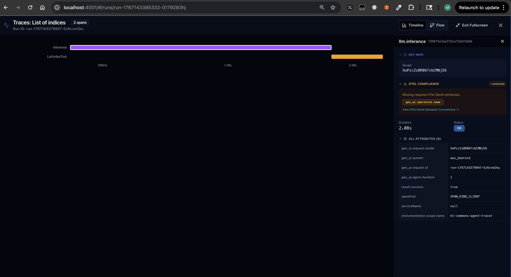

# Getting Started

This guide walks you through using Agent Health to evaluate Root Cause Analysis (RCA) agents. The application includes sample data so you can explore all features without configuring external services.

## Table of Contents

1. [Quick Start](#quick-start)
2. [Installation Methods](#installation-methods)
3. [Demo Mode Features](#demo-mode-features)
4. [Configuration Options](#configuration-options)
5. [Exploring the UI](#exploring-the-ui)
6. [Screenshots Walkthrough](#screenshots-walkthrough)
7. [API Reference](#api-reference)
8. [Troubleshooting](#troubleshooting)

---

## Quick Start

### Using npx (Recommended - No Installation Required)

Run Agent Health instantly without cloning the repository:

```bash
# Start in demo mode (default)
npx @opensearch-project/agent-health

# With custom port
npx @opensearch-project/agent-health --port 8080

# With environment file
npx @opensearch-project/agent-health --env-file .env

# Interactive configuration mode
npx @opensearch-project/agent-health --configure
```

The application will:
1. Download and start automatically
2. Open your browser to `http://localhost:4001`
3. Display pre-loaded sample data for exploration

### Prerequisites

- **Node.js 18+** - Required for running the application
- **npm** - Comes with Node.js

Check your versions:
```bash
node --version  # Should be v18.0.0 or higher
npm --version   # Should be v8.0.0 or higher
```

---

## Installation Methods

### Method 1: npx (Zero Installation)

Best for quick demos and evaluation:

```bash
npx @opensearch-project/agent-health
```

### Method 2: Global Installation

For frequent use:

```bash
# Install globally
npm install -g @opensearch-project/agent-health

# Run from anywhere
agent-health
```

### Method 3: Clone Repository

For development or customization:

```bash
# Clone the repository
git clone https://github.com/opensearch-project/dashboards-traces.git
cd dashboards-traces

# Install dependencies
npm install

# Start development server
npm run server
```

---

## Demo Mode Features

When running without external configuration, Agent Health provides a fully-functional demo environment:

### Sample Data Included

| Data Type | Count | Description |
|-----------|-------|-------------|
| Test Cases | 5 | Pre-configured RCA scenarios |
| Experiments | 1 | Demo experiment with completed run |
| Runs | 5 | Completed evaluation results |
| Traces | 5 | OpenTelemetry spans for visualization |

### Mock Services

- **Mock Agent** - Simulates agent responses with realistic trajectories
- **Mock Judge** - Provides evaluation scores without AWS Bedrock

All sample data IDs start with `demo-` prefix and are read-only.

---

## Configuration Options

### CLI Options

```
agent-health [options]

Options:
  -V, --version          Output version number
  -d, --demo             Run in demo mode with sample data (default)
  -c, --configure        Run interactive configuration wizard
  -p, --port <number>    Server port (default: "4001")
  -e, --env-file <path>  Load environment variables from file
  --no-browser           Do not open browser automatically
  -h, --help             Display help
```

### Environment File

Create a `.env` file for persistent configuration:

```bash
# Required for real LLM Judge (optional in demo mode)
AWS_REGION=us-west-2
AWS_ACCESS_KEY_ID=your_key
AWS_SECRET_ACCESS_KEY=your_secret

# Optional: OpenSearch Storage
OPENSEARCH_STORAGE_ENDPOINT=https://your-cluster.opensearch.amazonaws.com
OPENSEARCH_STORAGE_USERNAME=admin
OPENSEARCH_STORAGE_PASSWORD=your_password

# Optional: Traces (reuse the same cluster for simplicity)
OPENSEARCH_LOGS_ENDPOINT=https://your-traces-cluster.opensearch.amazonaws.com
OPENSEARCH_LOGS_TRACES_INDEX=otel-v1-apm-span-*
```

Use this for custom env file path (defaults to root folder for .env file):
```bash
npx @opensearch-project/agent-health --env-file .env
```

### Interactive Configuration

The `--configure` flag launches a wizard:

```bash
npx @opensearch-project/agent-health --configure
```

This will prompt for:
1. OpenSearch storage configuration
2. Agent type (Mock, ML-Commons, Langgraph)
3. LLM Judge type (Mock, AWS Bedrock)
4. Trace visualization settings

Configuration is saved to `~/.agent-health/config.json` for future use.

---

## Exploring the UI

### 1. Dashboard Overview

The main dashboard displays:
- Active experiments and their status
- Recent evaluation runs
- Quick statistics on pass/fail rates

### 2. Use Cases (Test Cases)

Navigate to **Settings > Use Cases** to see sample RCA scenarios:

| Use Case | Description | Difficulty |
|----------|-------------|------------|
| Payment Service Latency Spike | 5x latency increase investigation | Medium |
| Cart Service Error Rate Spike | Checkout failure debugging | Medium |
| Database Connection Pool Exhaustion | Flash sale database issues | Hard |
| Recommendation Service Cold Start | Pod scaling diagnosis | Medium |
| Cascading Failure Investigation | Multi-service failure trace | Hard |

Each use case includes:
- **Initial Prompt** - The question asked to the agent
- **Context** - Supporting data (metrics, logs, architecture)
- **Expected Outcomes** - What the agent should discover

### 3. Experiments

Navigate to **Experiments** to see the demo experiment:

- **RCA Agent Evaluation - Demo**
  - 5 test cases included
  - 1 completed baseline run
  - Results with trajectories and judge scores

### 4. Run Results

Click any run to view:

#### Trajectory View
Step-by-step agent execution:
- **Thinking** - Agent's internal reasoning
- **Actions** - Tool invocations
- **Tool Results** - Tool responses
- **Response** - Final conclusions

#### LLM Judge Evaluation
- **Pass/Fail Status** - Did the agent meet expected outcomes?
- **Accuracy Score** - Performance metric (0-100%)
- **Reasoning** - Judge's detailed analysis
- **Improvement Strategies** - Suggestions for better performance

### 5. Live Traces

Navigate to **Traces** for real-time trace monitoring:

- **Live Tailing** - Auto-refresh traces every 10 seconds with pause/resume controls
- **Agent Filter** - Filter traces by specific agent
- **Text Search** - Search span names and attributes

#### View Modes

Toggle between visualization modes using the view selector:

| View | Best For | Description |
|------|----------|-------------|
| **Timeline** | Detailed timing analysis | Hierarchical span tree with duration bars |
| **Flow** | DAG visualization | Graph-based view of span relationships |

#### Full Screen Mode

Click the **Maximize** button on any trace visualization to open full-screen mode with:
- Larger visualization area
- Detailed span attributes panel
- Collapsible sections for complex traces

### 6. Trace Comparison

The comparison view supports side-by-side trace analysis:

- **Aligned view** - Spans from different runs aligned by similarity
- **Merged view** - Combined flow visualization showing all traces
- **Horizontal/Vertical orientation** - Toggle layout for your preference

---

## Screenshots Walkthrough

### Dashboard

The main dashboard provides an overview of your agent evaluation status:



Key features shown:
- **Quick Stats** - Experiments count, test cases, pass rates, costs
- **Experiments List** - Recent experiments with status indicators
- **Metrics Trend** - Cost and performance over time

---

### Test Cases

The Test Cases page lets you manage your evaluation scenarios:



Features:
- **Search & Filter** - Find test cases by name, category, or difficulty
- **Labels** - Visual tags for difficulty (Easy/Medium/Hard) and test type
- **Quick Actions** - Run, edit, or delete test cases

#### Creating a Test Case

Click "New Use Case" to create a new test case:


The form includes:
- **Name & Description** - Identify the scenario
- **Initial Prompt** - The question for the agent
- **Context** - Supporting data (metrics, logs, architecture)
- **Expected Outcomes** - What the agent should discover
- **Labels** - Categorization and difficulty level

---

### Experiments

View and manage batch evaluations:



Each experiment card shows:
- **Run Count** - How many evaluation runs have been performed
- **Use Cases** - Number of test cases included
- **Run History** - Names of previous runs
- **Last Run Date** - When the experiment was last executed

---

### Experiment Detail

Click "View Latest" to see detailed results:


The detail view includes:
- **Pass Rate** - Percentage of test cases that passed (80% = 4/5 passed)
- **Avg Accuracy** - Mean accuracy across all evaluations (88%)
- **Charts** - Visual pass/fail and accuracy breakdowns by run
- **Per Use Case Breakdown** - Individual results for each test case

#### Full Results View

Scroll down to see all test case results:



Each test case shows:
- **Status** - PASSED (green) or FAILED (red)
- **Accuracy** - Judge's accuracy score (0-100%)
- **Steps** - Number of trajectory steps taken by the agent
- **Difficulty Labels** - Medium, Hard, etc.

---

### Live Traces

The Traces page provides real-time monitoring of agent executions:

<video src="./screenshots/traces-view.mov" controls width="100%">
  Your browser does not support the video tag. <a href="./screenshots/traces-view.mov">Download the video</a>
</video>

Features shown:
- **Live Tailing** - Auto-refresh with pause/resume controls
- **Agent Filter** - Filter traces by specific agent
- **Timeline/Flow Toggle** - Switch between visualization modes
- **Span Details** - Click any span to see attributes

---

### Full Screen View

Click the maximize button on any trace to open full-screen mode:



Full screen mode provides:
- **Expanded Visualization** - Larger area for complex traces
- **Span Attributes Panel** - Detailed metadata for selected spans
- **Collapsible Sections** - Focus on specific parts of the trace
- **View Mode Toggle** - Switch between Timeline and Flow views

---

## API Reference

### Storage APIs

```bash
# List test cases
GET /api/storage/test-cases

# Get specific test case
GET /api/storage/test-cases/:id

# List experiments
GET /api/storage/experiments

# List runs
GET /api/storage/runs

# Get runs by test case
GET /api/storage/runs/by-test-case/:testCaseId
```

### Traces API

```bash
# Fetch trace by ID
GET /api/traces?traceId=<trace-id>

# Fetch traces by run IDs
GET /api/traces?runIds=<id1>,<id2>

# Health check
GET /api/traces/health
```

### Judge API

```bash
# Evaluate trajectory
POST /api/judge
Content-Type: application/json

{
  "trajectory": [...],
  "expectedOutcomes": [...],
  "modelId": "anthropic.claude-3-5-sonnet-..."
}
```

---

## Troubleshooting

### "Port already in use"

Change the port:
```bash
npx @opensearch-project/agent-health --port 8080
```

### "OpenSearch not configured" Messages

This is expected in demo mode. Sample data is displayed instead of real data.

### Agent Query Returns Empty Traces

- Traces take ~2-5 minutes to propagate after agent execution
- Use the refresh button to re-fetch
- Check OTEL configuration if traces never appear

### LLM Judge Timeouts

In demo mode, the mock judge is used. For real evaluations:
- Verify AWS credentials in your `.env` file
- Check Bedrock model access in your AWS account

### Browser Not Opening

If `--no-browser` wasn't specified but browser doesn't open:
```bash
# Manually open
open http://localhost:4001  # macOS
xdg-open http://localhost:4001  # Linux
start http://localhost:4001  # Windows
```

### Module Not Found Errors

Ensure you have Node.js 18+:
```bash
node --version
```

Clear npm cache if needed:
```bash
npm cache clean --force
npx clear-npx-cache  # Clear npx cache
```

---

## Next Steps

1. **Explore Sample Data** - Familiarize yourself with the UI using demo data
2. **Configure Real Services** - Connect OpenSearch and Bedrock for production use
3. **Create Custom Use Cases** - Design test scenarios for your domain
4. **Run Evaluations** - Execute experiments and analyze results
5. **Integrate CI/CD** - Automate evaluations in your pipeline

### Related Documentation

- [CLAUDE.md](../CLAUDE.md) - Development guide and architecture
- [ML-COMMONS-SETUP.md](./ML-COMMONS-SETUP.md) - ML Commons agent configuration
- [.env.example](../.env.example) - Environment variable reference
